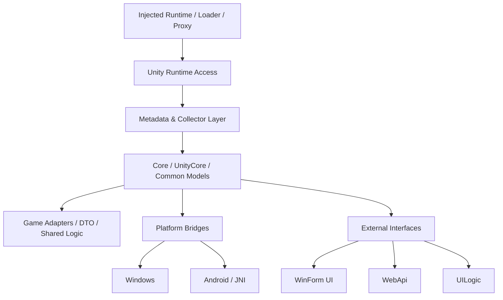
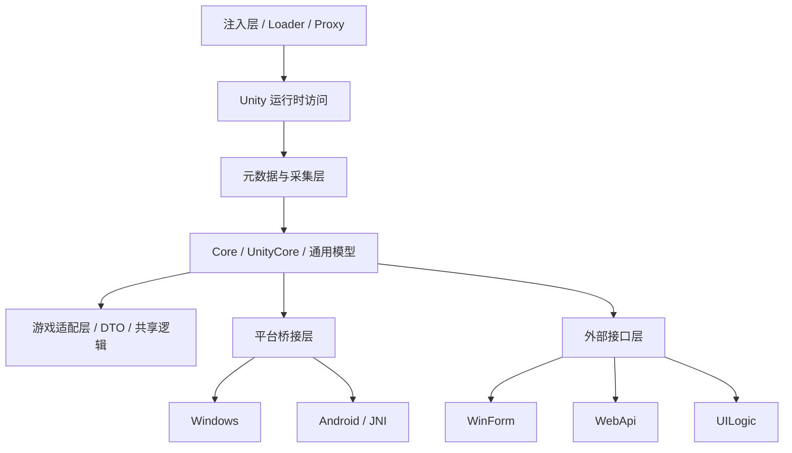

# Maple.UnityCheatFramework

[中文](#中文说明) | [English](#english)

---

## English

Maple.UnityCheatFramework is a Unity game runtime interoperability framework focused on **C# AOT**, **Mono**, and **IL2CPP** scenarios.

Its goal is to help you build external tooling and runtime integrations for shipped Unity games **without depending on the Unity Editor or the original Unity project**.

### What this repository is for

This repository is designed for workflows such as:

- reading and modeling Unity game metadata
- bridging managed and native/runtime boundaries
- building game-specific adapters on top of shared infrastructure
- exposing runtime capabilities through desktop UI or Web APIs
- supporting multiple target platforms such as Windows and Android

In practice, this project is closer to a **runtime interop framework** than a traditional Unity gameplay plugin.

### Architecture overview

### Repository structure

#### Core and shared runtime layers

- `Maple.MonoGameAssistant.Core`
- `Maple.MonoGameAssistant.Common`
- `Maple.MonoGameAssistant.UnityCore`
- `Maple.MonoGameAssistant.Model`
- `Maple.MonoGameAssistant.Logger`

These projects provide common infrastructure, shared runtime utilities, Unity-facing abstractions, and reusable models.

#### Game abstraction layers

- `Maple.MonoGameAssistant.GameCore`
- `Maple.MonoGameAssistant.GameShared`
- `Maple.MonoGameAssistant.GameDTO`
- `Maple.MonoGameAssistant.GameSSR`
- `Maple.MonoGameAssistant.GameWASM`

These projects support game-facing abstractions, DTOs, and higher-level integration surfaces.

#### Metadata and collection pipeline

- `Maple.MonoGameAssistant.MetadataCollections`
- `Maple.MonoGameAssistant.MetadataExtensions`
- `Maple.MonoGameAssistant.MetadataSourceGenerator`
- `Maple.MonoGameAssistant.MetadataUnity`
- `Maple.MonoGameAssistant.MetadataDemo`
- `Maple.MonoGameAssistant.MonoCollector`
- `Maple.MonoGameAssistant.MonoCollectorDataV2`
- `Maple.MonoGameAssistant.MonoCollectorExtensionsV2`
- `Maple.MonoGameAssistant.MonoCollectorGeneratorV2`
- `Maple.MonoGameAssistant.MonoDataCollector`

These modules are oriented around metadata extraction, collection, code generation, and runtime data modeling.

#### Platform integration

- `Maple.MonoGameAssistant.Windows`
- `Maple.MonoGameAssistant.AndroidCore`
- `Maple.MonoGameAssistant.AndroidJNI`
- `Maple.MonoGameAssistant.AndroidModel`

These projects provide platform-specific integration layers for Windows and Android runtimes.

#### UI and external interfaces

- `Maple.MonoGameAssistant.UILogic`
- `Maple.MonoGameAssistant.WinForm`
- `Maple.MonoGameAssistant.WebApi`
- `Maple.MonoGameAssistant.WebApiLauncher`

These projects expose framework capabilities through user interfaces and service endpoints.

#### Native/proxy components

- `Maple.MonoGameAssistant.DllProxyStaticLib`

This project supports native bridging or proxy-based integration scenarios.

### Relationship to BepInEx / MelonLoader

A useful mental model is:

- **BepInEx / MelonLoader** are typically used to load or inject code into a Unity game.
- **Maple.UnityCheatFramework** focuses more on what happens **after** runtime access is available: metadata, interop, modeling, platform bridges, tooling, and external interfaces.

That means this repository can complement loader-based approaches rather than replace them.

### Intended use cases

This framework may be useful when you want to:

- interact with Unity game runtime structures from external tooling
- support AOT-sensitive or IL2CPP-heavy environments
- create reusable game adapters instead of one-off scripts
- expose runtime data through APIs, desktop tools, or platform-specific bridges
- build a maintainable foundation for advanced Unity game tooling

### Quick start

1. Open `Maple.MonoGameAssistant.slnx`
2. Start with the following projects:
   - `Maple.MonoGameAssistant.Core`
   - `Maple.MonoGameAssistant.UnityCore`
   - `Maple.MonoGameAssistant.GameCore`
3. Then review:
   - metadata and collector projects
   - platform-specific projects
   - UI / WebApi projects
4. Finally, inspect one of the demo repositories below to understand a real integration path.

### NuGet

NuGet packages are published under the BlackMaple profile:

- https://www.nuget.org/profiles/BlackMaple

### Cheat demos

#### Win x64

- https://github.com/blackmaple/Maple.AzureValley
- https://github.com/blackmaple/Maple.Ghostmon
- https://github.com/blackmaple/Maple.Bloomtown
- https://github.com/blackmaple/Maple.TstdGame
- https://github.com/blackmaple/Maple.Nexomon

#### Win x86

- https://github.com/blackmaple/Maple.CatQuest3

#### Android arm64

- https://github.com/blackmaple/Maple.Nexomon
- https://github.com/blackmaple/Maple.TstdGame

#### Android mod UI

- https://github.com/blackmaple/com.android.maple
- https://github.com/blackmaple/Android-Mod-Menu

---

## 中文说明

Maple.UnityCheatFramework 是一个面向 **C# AOT**、**Mono**、**IL2CPP** 场景的 **Unity 游戏运行时互操作框架**。

它的目标是：在**不依赖 Unity Editor、也不需要原始 Unity 工程**的前提下，为已发布的 Unity 游戏构建外部工具、运行时集成能力，以及可复用的适配基础设施。

### 这个仓库解决什么问题

这个仓库主要面向以下需求：

- 读取并建模 Unity 游戏运行时元数据
- 处理托管层与原生/运行时边界之间的互操作
- 在共享基础设施上构建具体游戏适配层
- 通过桌面 UI 或 Web API 暴露运行时能力
- 支持 Windows、Android 等不同平台的接入场景

从定位上看，它更接近一个 **runtime interop framework**，而不是传统意义上的 Unity gameplay 插件。

### 架构概览

### 仓库结构

#### 核心与共享运行时层

- `Maple.MonoGameAssistant.Core`
- `Maple.MonoGameAssistant.Common`
- `Maple.MonoGameAssistant.UnityCore`
- `Maple.MonoGameAssistant.Model`
- `Maple.MonoGameAssistant.Logger`

这些项目提供公共基础设施、共享运行时工具、Unity 相关抽象以及可复用模型。

#### 游戏抽象层

- `Maple.MonoGameAssistant.GameCore`
- `Maple.MonoGameAssistant.GameShared`
- `Maple.MonoGameAssistant.GameDTO`
- `Maple.MonoGameAssistant.GameSSR`
- `Maple.MonoGameAssistant.GameWASM`

这些项目主要承载面向游戏的抽象、DTO 以及更高层的集成接口。

#### 元数据与采集链路

- `Maple.MonoGameAssistant.MetadataCollections`
- `Maple.MonoGameAssistant.MetadataExtensions`
- `Maple.MonoGameAssistant.MetadataSourceGenerator`
- `Maple.MonoGameAssistant.MetadataUnity`
- `Maple.MonoGameAssistant.MetadataDemo`
- `Maple.MonoGameAssistant.MonoCollector`
- `Maple.MonoGameAssistant.MonoCollectorDataV2`
- `Maple.MonoGameAssistant.MonoCollectorExtensionsV2`
- `Maple.MonoGameAssistant.MonoCollectorGeneratorV2`
- `Maple.MonoGameAssistant.MonoDataCollector`

这些模块主要围绕元数据提取、采集、代码生成和运行时数据建模展开。

#### 平台集成层

- `Maple.MonoGameAssistant.Windows`
- `Maple.MonoGameAssistant.AndroidCore`
- `Maple.MonoGameAssistant.AndroidJNI`
- `Maple.MonoGameAssistant.AndroidModel`

这些项目提供 Windows 和 Android 运行时场景下的平台接入能力。

#### UI 与外部接口层

- `Maple.MonoGameAssistant.UILogic`
- `Maple.MonoGameAssistant.WinForm`
- `Maple.MonoGameAssistant.WebApi`
- `Maple.MonoGameAssistant.WebApiLauncher`

这些项目用于通过 UI 或服务接口对外暴露框架能力。

#### 原生 / 代理组件

- `Maple.MonoGameAssistant.DllProxyStaticLib`

这个项目用于支持原生桥接或基于代理的集成方案。

### 和 BepInEx / MelonLoader 的关系

可以这样理解：

- **BepInEx / MelonLoader** 更偏向“如何把代码加载/注入到 Unity 游戏中”
- **Maple.UnityCheatFramework** 更偏向“拿到运行时访问能力之后，如何做元数据、互操作、对象建模、平台桥接、工具化与外部接口”

所以它更适合作为 loader 方案的补充，而不是简单替代它们。

### 适用场景

当你有以下需求时，这个框架会比较适合：

- 从外部工具与 Unity 游戏运行时结构交互
- 处理 AOT 敏感或 IL2CPP 为主的运行环境
- 为多个游戏构建可复用适配层，而不是写一次性脚本
- 通过 API、桌面工具或平台桥接暴露运行时数据与能力
- 为复杂 Unity 游戏工具链建立可维护的基础设施

### 快速开始

1. 打开 `Maple.MonoGameAssistant.slnx`
2. 优先阅读以下核心项目：
   - `Maple.MonoGameAssistant.Core`
   - `Maple.MonoGameAssistant.UnityCore`
   - `Maple.MonoGameAssistant.GameCore`
3. 然后再看：
   - 元数据与采集相关项目
   - 平台相关项目
   - UI / WebApi 相关项目
4. 最后结合下面的 demo 仓库，理解一条真实的落地接入路径。

### NuGet

NuGet 包发布在 BlackMaple 账号下：

- https://www.nuget.org/profiles/BlackMaple

### Cheat Demo

#### Win x64

- https://github.com/blackmaple/Maple.AzureValley
- https://github.com/blackmaple/Maple.Ghostmon
- https://github.com/blackmaple/Maple.Bloomtown
- https://github.com/blackmaple/Maple.TstdGame
- https://github.com/blackmaple/Maple.Nexomon

#### Win x86

- https://github.com/blackmaple/Maple.CatQuest3

#### Android arm64

- https://github.com/blackmaple/Maple.Nexomon
- https://github.com/blackmaple/Maple.TstdGame

#### Android mod UI

- https://github.com/blackmaple/com.android.maple
- https://github.com/blackmaple/Android-Mod-Menu

## License

MIT
